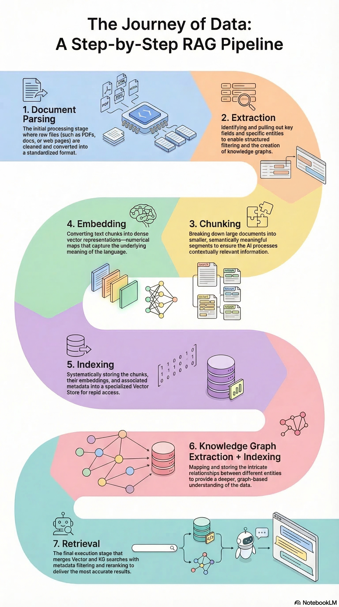

# RAG-factory
> End-to-end exploration of Retrieval-Augmented Generation pipelines across two real-world domains, comparing frameworks, patterns, and evaluation strategies.

## Domains:

- **Mechanical Parts Catalogs** — structured, technical, terminology-heavy documents
- **Medical Bills** — semi-structured, entity-rich, compliance-sensitive documents

## Coming soon:
- WIKI page hosting the project documentation
- RAG-Chatbot with UI

---

## Pipeline

<p align="center">
  
</p>

---

## RAG Patterns

| Pattern | Description |
|---|---|
| **Naive RAG** | Baseline — embed, index, retrieve, generate |
| **Hybrid RAG** | Dense + sparse (BM25) retrieval with re-ranking |
| **KG-RAG** | Knowledge Graph-augmented retrieval for relational reasoning |
| **Agentic RAG** | Tool-calling agents with multi-step reasoning and answer validation |

### Agentic RAG Stack
- **PydanticAI** — typed tool-calling agents with structured outputs
- **ReAct** — Reasoning + Acting loop for multi-hop queries
- **smolagents** — lightweight agents with minimal boilerplate

Key agentic behaviors implemented:
- Dynamic tool selection (search, filter, compute)
- Multi-step reasoning before answer generation
- Self-verification — agent checks answer against retrieved context before responding

<!-- ---

## Frameworks

Both pipelines are implemented and compared across two frameworks:

- **LlamaIndex** — primary implementation (connectors, query engines, agent tools)
- **LangChain** — parallel implementation for direct comparison (chains, retrievers, agents) -->

---

## Project Structure

```
rag-factory/
├── rag-domain                 # Mechanical catalogs/Medical bills
│   ├── data/                  # Raw documents
│   ├── pipelines/ 
│   │   ├── ingestion/
│   │   ├── chunking/
│   │   ├── embedding/
│   │   ├── indexing/
│   │   ├── retrieval/
│   ├── patterns/ 
│   │   ├── hybrid_rag/
│   │   ├── kg_rag/
│   │   ├── agentic_rag/
│   ├── evaluation/            # RAGAS scoring + comparison notebooks
│   ├── ui/                    # Chatbot interface
└── README.md
```