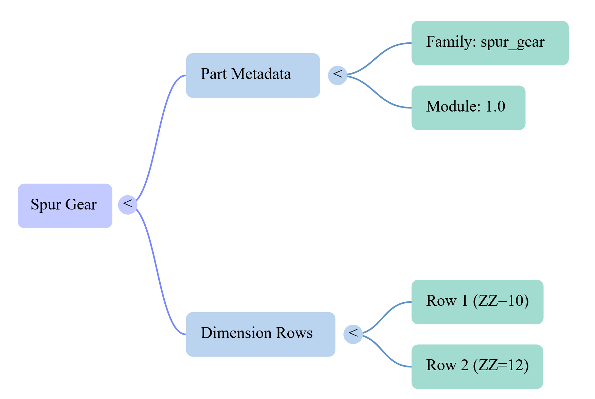
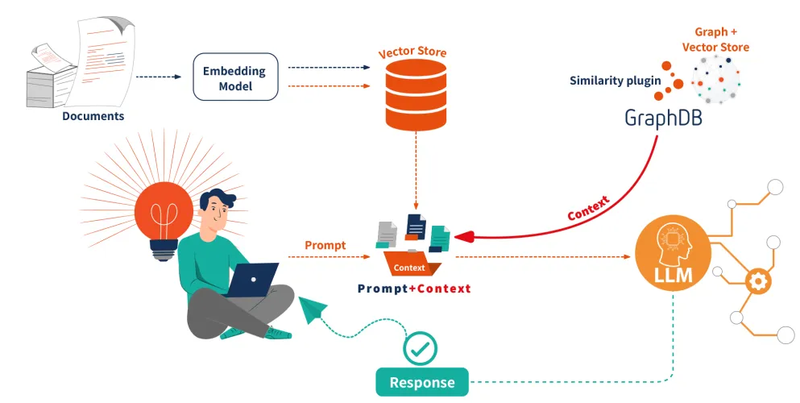

# Mechanical Parts Catalog — RAG Pipeline Stages

A production-ready RAG pipeline built for querying industrial catalogs of mechanical parts using hybrid vector search, metadata filtering, and knowledge graph traversal — going well beyond a standard RAG setup.

---

## Pipeline Stages

- <ins>**Step 1 — Two-Layer Document Extraction**</ins>:
  - **Layer 1**: extracts ``part-level metadata`` (family, material, module, tooth type, engagement angle)
  - **Layer 2**: extracts every ``row-level dimension data`` (teeth count, diameters, weight, torque, article number)

  

    
  

- <ins>**Step 2 — Normalization & ID Assignment**</ins>:
  - Family, material, and module values normalized to canonical forms 
  - A deterministic `part_id` is built from `(family, module, material)` for each part and row

- <ins>**Step 3 — Layer Mapping & Join**</ins>:
  - Layer 1 **parts** and Layer 2 **rows** get joined via matching `part_id`
  - Orphaned rows (unmatched) are logged with their unmatched IDs for inspection

- <ins>**Step 4 —  Hierarchical Node Construction (Parent-Child Node Graph)**</ins>:
  - **Parent nodes** — ``one per mechanical part``, carrying part-level metadata
  - **Child nodes** — ``one per table row``, linked back to their parent via `parent_node_id`
  - Parent nodes carry a ``natural-language descriptive text`` for embedding, alongside ``structured metadata`` for exact and range filtering; child nodes follow the same split.
  
- <ins>**Step 5 — Dual Indexing**</ins>:

  | Store | Purpose |
  |---|---|
  | pgvector (basic) | Dense vector similarity search |
  | pgvector (hybrid) | Dense vector + BM25 keyword search |
  | Neo4j | Knowledge graph with schema-validated typed relationships between entities: `GEAR`, `MATERIAL`, `MODULE`, `FAMILY`, `ARTICLE` |

- **Step 6 — Metadata filtering + Query Intent Extraction**
  - User query parsed into a structured `QueryIntent` object
  - Extracts ``exact-match fields`` (family, material, module) and ``range filters`` (torque, weight, teeth count, diameters)

- **Step 7 — Retrieval**
  - **Vector retriever** — dense semantic search (pgvector)
  - **Hybrid retriever** — dense + BM25 keyword search (pgvector)
  - **Hybrid + metadata filtering** — hybrid search with structured filters on numeric dimensions
  - **KG retriever** — graph traversal via typed relations + LLM synonym expansion (Neo4j)
  - **Custom fusion retriever** — combines hybrid + metadata filtering and KG retrieval, re-ranks results

- **Step 8 — Response Synthesis**
  - Retrieved nodes passed to an LLM with a domain-grounded prompt
  - Responses grounded strictly in catalog data with page-level source references

  

    
  

---

## Stack Summary

| Layer | Tools |
|---|---|
| Frameworks | LlamaIndex, LlamaCloud |
| Agentic | PydanticAI, ReAct, smolagents |
| Hybrid Search | PostgreSQL + pgvector |
| Graph Store | Neo4j |
| Embeddings | OpenAI, BGE |
| Re-ranking | JINA Reranker / ms-marco-MiniLM-L2-v2 |
| Evaluation | RAGAS |
| UI | Streamlit / Gradio |

[🔼 Back to top](#rag-pipeline-stages)
