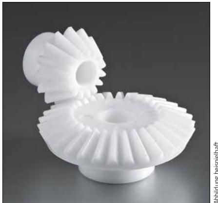

# Kegelräder aus Polyacetal (POM)

# Übersetzung 1:2

Ausführung: geradverzahnt, gespritzt, Eingriffswinkel $2 0 ^ { \circ }$ , Bohrung spanabhebend bearbeitet.   
Maßänderung vorbehalten.

<table><tr><td rowspan=1 colspan=1>M</td><td rowspan=1 colspan=1>z</td><td rowspan=1 colspan=1>OB₁[mm]</td><td rowspan=1 colspan=1>ON,|[mm]</td><td rowspan=1 colspan=1>TK,[mm]</td><td rowspan=1 colspan=1>OKK,[mm]</td><td rowspan=1 colspan=1>E₁[mm]</td><td rowspan=1 colspan=1>NL,|[mm]</td><td rowspan=1 colspan=1>ZB[mm]</td><td rowspan=1 colspan=1>Q1|[mm]|</td><td rowspan=1 colspan=1>L[mm]</td><td rowspan=1 colspan=1>G[g]</td><td rowspan=1 colspan=1>DM**[Ncm]</td><td rowspan=1 colspan=1>Art.-Nr.</td></tr><tr><td rowspan=1 colspan=1>1,0</td><td rowspan=1 colspan=1>15</td><td rowspan=1 colspan=1>5</td><td rowspan=1 colspan=1>12,2</td><td rowspan=1 colspan=1>15</td><td rowspan=1 colspan=1>16,6</td><td rowspan=1 colspan=1>26,3</td><td rowspan=1 colspan=1>10,5</td><td rowspan=1 colspan=1>6.4</td><td rowspan=1 colspan=1>17,1</td><td rowspan=1 colspan=1>17,1</td><td rowspan=1 colspan=1>2.4</td><td rowspan=1 colspan=1>12,06</td><td rowspan=1 colspan=1>KH1015-1:2HF</td></tr><tr><td rowspan=1 colspan=1>1,5</td><td rowspan=1 colspan=1>15</td><td rowspan=1 colspan=1>8</td><td rowspan=1 colspan=1>17</td><td rowspan=1 colspan=1>22,5</td><td rowspan=1 colspan=1>25</td><td rowspan=1 colspan=1>35,8</td><td rowspan=1 colspan=1>11,7</td><td rowspan=1 colspan=1>10,5</td><td rowspan=1 colspan=1>22,8</td><td rowspan=1 colspan=1>22,8</td><td rowspan=1 colspan=1>7.5</td><td rowspan=1 colspan=1>44,54</td><td rowspan=1 colspan=1>KH1515-1:2HF</td></tr><tr><td rowspan=1 colspan=1>2,0</td><td rowspan=1 colspan=1>15</td><td rowspan=1 colspan=1>10</td><td rowspan=1 colspan=1>22,6</td><td rowspan=1 colspan=1>30</td><td rowspan=1 colspan=1>33,3</td><td rowspan=1 colspan=1>44</td><td rowspan=1 colspan=1>12</td><td rowspan=1 colspan=1>14,5</td><td rowspan=1 colspan=1>26</td><td rowspan=1 colspan=1>27</td><td rowspan=1 colspan=1>13,3</td><td rowspan=1 colspan=1>109,33</td><td rowspan=1 colspan=1>KH2015-1:2HF</td></tr><tr><td rowspan=1 colspan=1>2,5</td><td rowspan=1 colspan=1>15</td><td rowspan=1 colspan=1>12</td><td rowspan=1 colspan=1>26,5</td><td rowspan=1 colspan=1>37.5</td><td rowspan=1 colspan=1>42</td><td rowspan=1 colspan=1>53,3</td><td rowspan=1 colspan=1>12,7</td><td rowspan=1 colspan=1>17,1</td><td rowspan=1 colspan=1>29.5</td><td rowspan=1 colspan=1>31,1</td><td rowspan=1 colspan=1>23,6</td><td rowspan=1 colspan=1>201,46</td><td rowspan=1 colspan=1>KH2515-1:2HF</td></tr><tr><td rowspan=1 colspan=1>3,0</td><td rowspan=1 colspan=1>15</td><td rowspan=1 colspan=1>14</td><td rowspan=1 colspan=1>31,2</td><td rowspan=1 colspan=1>45</td><td rowspan=1 colspan=1>50</td><td rowspan=1 colspan=1>63.3</td><td rowspan=1 colspan=1>15,3</td><td rowspan=1 colspan=1>20,2</td><td rowspan=1 colspan=1>34,8</td><td rowspan=1 colspan=1>36,4</td><td rowspan=1 colspan=1>38</td><td rowspan=1 colspan=1>342,69</td><td rowspan=1 colspan=1>KH3015-1:2HF</td></tr></table>

<table><tr><td rowspan=2 colspan=1>M</td><td rowspan=2 colspan=1>z</td><td rowspan=2 colspan=1>$$B₂$[mm]</td><td rowspan=2 colspan=1>$ON₂$[mm]</td><td rowspan=2 colspan=1>_TK2$[mm]</td><td rowspan=2 colspan=1>oKK2$[mm]</td><td rowspan=2 colspan=1>$E_$[mm]</td><td rowspan=1 colspan=1>NL₂</td><td rowspan=2 colspan=1>ZB[mm]</td><td rowspan=2 colspan=1>$Q_₂$[mm]</td><td rowspan=2 colspan=1>L[mm]</td><td rowspan=2 colspan=1>G[g]</td><td rowspan=2 colspan=1>DM**[Ncm]</td><td rowspan=2 colspan=1>Art.-Nr.</td></tr><tr><td rowspan=1 colspan=1>[mm]</td></tr><tr><td rowspan=1 colspan=1>1,0</td><td rowspan=1 colspan=1>30</td><td rowspan=1 colspan=1>8</td><td rowspan=1 colspan=1>18</td><td rowspan=1 colspan=1>30</td><td rowspan=1 colspan=1>31</td><td rowspan=1 colspan=1>20,8</td><td rowspan=1 colspan=1>9</td><td rowspan=1 colspan=1>6,9</td><td rowspan=1 colspan=1>14,7</td><td rowspan=1 colspan=1>16</td><td rowspan=1 colspan=1>7</td><td rowspan=1 colspan=1>26,02</td><td rowspan=1 colspan=1>KH1030-1:2HF</td></tr><tr><td rowspan=1 colspan=1>1,5</td><td rowspan=1 colspan=1>30</td><td rowspan=1 colspan=1>10</td><td rowspan=1 colspan=1>23.4</td><td rowspan=1 colspan=1>45</td><td rowspan=1 colspan=1>46,3</td><td rowspan=1 colspan=1>25,9</td><td rowspan=1 colspan=1>9,6</td><td rowspan=1 colspan=1>10,7</td><td rowspan=1 colspan=1>17.5</td><td rowspan=1 colspan=1>19,6</td><td rowspan=1 colspan=1>18</td><td rowspan=1 colspan=1>90,76</td><td rowspan=1 colspan=1>KH1530-1:2HF</td></tr><tr><td rowspan=1 colspan=1>2,0</td><td rowspan=1 colspan=1>30</td><td rowspan=1 colspan=1>12</td><td rowspan=1 colspan=1>30,2</td><td rowspan=1 colspan=1>60</td><td rowspan=1 colspan=1>62</td><td rowspan=1 colspan=1>32,9</td><td rowspan=1 colspan=1>12</td><td rowspan=1 colspan=1>14,2</td><td rowspan=1 colspan=1>22,4</td><td rowspan=1 colspan=1>24,5</td><td rowspan=1 colspan=1>42</td><td rowspan=1 colspan=1>214,13</td><td rowspan=1 colspan=1>KH2030-1:2HF</td></tr><tr><td rowspan=1 colspan=1>2,5</td><td rowspan=1 colspan=1>30</td><td rowspan=1 colspan=1>16</td><td rowspan=1 colspan=1>35,8</td><td rowspan=1 colspan=1>75</td><td rowspan=1 colspan=1>77.2</td><td rowspan=1 colspan=1>40.8</td><td rowspan=1 colspan=1>15,2</td><td rowspan=1 colspan=1>17.4</td><td rowspan=1 colspan=1>27.6</td><td rowspan=1 colspan=1>29,6</td><td rowspan=1 colspan=1>77</td><td rowspan=1 colspan=1>409,98</td><td rowspan=1 colspan=1>KH2530-1:2HF</td></tr><tr><td rowspan=1 colspan=1>3,0</td><td rowspan=1 colspan=1>30</td><td rowspan=1 colspan=1>18</td><td rowspan=1 colspan=1>45</td><td rowspan=1 colspan=1>90</td><td rowspan=1 colspan=1>92,5</td><td rowspan=1 colspan=1>49.9</td><td rowspan=1 colspan=1>19</td><td rowspan=1 colspan=1>20.3</td><td rowspan=1 colspan=1>33,8</td><td rowspan=1 colspan=1>37.5</td><td rowspan=1 colspan=1>136</td><td rowspan=1 colspan=1>695,55</td><td rowspan=1 colspan=1>KH3030-1:2HF</td></tr></table>

\*\*) Bitte Angaben zu Drehmoment auf S. 14 beachten.