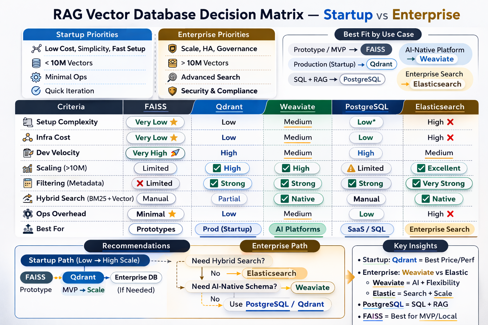

# Vector Stores for RAG Apps

A quick decision guide for choosing the right vector store depending on your context.

---

## 📊 Comparison Overview

| Vector DB | Type | Storage | Deployment | Indexing | Filtering | Scalability | Pros | Cons |
|---|---|---|---|---|---|---|---|---|
| **FAISS** | Library (not full DB) | In-memory (disk optional) | Embedded (Python/C++) | IVF, HNSW, PQ, Flat | ❌ Limited (manual) | Single-node (distributed via wrappers) | Extremely fast, highly optimized, great for research/local RAG | No native API/server, no metadata filtering engine, manual scaling |
| **Weaviate** | Full vector DB | Disk-backed | Self-hosted / Cloud | HNSW | ✅ Rich filtering | Horizontally scalable | Built-in REST/GraphQL API, hybrid search (BM25 + vector), schema-based, production-ready | Heavier setup, more infra complexity |
| **Qdrant** | Full vector DB | Disk-backed | Self-hosted / Cloud | HNSW | ✅ Payload filtering | Horizontally scalable | Lightweight, strong filtering, high performance, simple API | Fewer ecosystem integrations than Elasticsearch |
| **PostgreSQL (pgvector)** | Extension to relational DB | Disk-backed | Self-hosted / Managed | IVF, HNSW (newer versions) | ✅ SQL filtering | Vertical (limited horizontal) | Combines relational + vector, transactional, easy adoption | Slower at very large scale vs specialized DBs |
| **Elasticsearch** | Search engine | Disk-backed | Self-hosted / Cloud | HNSW | ✅ Advanced filtering | Horizontally scalable | Hybrid search, mature ecosystem, strong text search | Higher resource usage, heavier ops overhead |

<details>
<summary> 🔑 Key Concepts Explained</summary>

### 1️⃣ HNSW (Hierarchical Navigable Small World)

A fast approximate nearest neighbor (ANN) search algorithm. Instead of comparing against every vector, it navigates a graph structure to quickly find close matches.

**Example — query:** *"What are the safety requirements for hydraulic presses?"*

1. Query is converted to an embedding
2. HNSW graph is navigated to jump to similar vectors
3. Top-k closest chunks returned in milliseconds

> Without HNSW, every query would compare against millions of vectors — much slower.

---

### 2️⃣ Payload Filtering *(Qdrant)*

Filtering search results using metadata stored alongside each vector (called "payload" in Qdrant).

Each vector can carry structured fields like `document_id`, `customer_id`, `language`, `date`, `category`.

**Example — stored document:**
```json
{
  "vector": ["..."],
  "payload": {
    "customer_id": "BMW",
    "language": "de",
    "year": 2024
  }
}
```

**Query:** *"Warranty rules"* — but only for `customer_id = "BMW"` and `language = "de"`

Qdrant first filters by metadata, then runs vector similarity search only inside that subset.

> Critical for: multi-tenant SaaS, access control, enterprise RAG.

---

### 3️⃣ Horizontally Scalable

Scale by adding more machines (nodes) instead of upgrading a single server.

| Type | Approach |
|---|---|
| Vertical scaling | Bigger server (more RAM / CPU) |
| Horizontal scaling | More servers (distributed nodes) |

**Example:**

- Start: 1 node, 10M vectors
- Grow to: 200M vectors + heavy query traffic
- Solution: add 3 more nodes → data shards across machines, queries are distributed, system handles the load

> Essential for enterprise workloads.
</details>

---

## 📟 Decision Matrix


<details>
<summary> By Profile </summary> 

#### 🚀 Startups
Optimize for fast iteration, minimal DevOps, low cost, and small-to-medium datasets.

- **Prototype / MVP** → FAISS
- **First production RAG app** → Qdrant
- **Already on Postgres** → pgvector

#### 🏢 Enterprises
Optimize for scalability, reliability, governance, security, hybrid search, and multi-team integration.

- **AI-native platform** → Weaviate
- **High-scale vector workloads** → Qdrant
- **Compliance / SQL integration** → PostgreSQL
- **Large hybrid search platform** → Elasticsearch
</details>

---

## 📐 Distance & Similarity Metrics

In RAG, vector stores retrieve chunks using a distance/similarity metric between the query embedding and stored embeddings. The two most common are **Cosine Similarity** and **L2 Distance (Euclidean)**. Some systems also use Dot Product, which is closely related to cosine.

### 🔍 Cosine vs L2

| Aspect | Cosine Similarity | L2 Distance (Euclidean) |
|---|---|---|
| What it measures | Angle between vectors | Straight-line distance |
| Sensitive to vector magnitude? | ❌ No (only direction matters) | ✅ Yes |
| Typical embedding assumption | Normalized embeddings | Raw embeddings |
| Common in LLM embeddings? | ⭐ Very common | Sometimes |
| Interpretation | "How aligned are they?" | "How far apart are they?" |
| Scale range | -1 to 1 | 0 to ∞ |
| Works best when | Vector length varies | Magnitude carries information |
| Default in many RAG systems | ⭐ Yes | Sometimes |


### ⚙️ When to Use Each

**✅ Use Cosine when:**
- Using OpenAI embeddings, sentence-transformers, or any normalized embeddings
- Building general-purpose semantic search or most RAG systems

> This is the most common choice in modern RAG.

**✅ Use L2 when:**
- Embeddings are NOT normalized
- Magnitude encodes meaning
- Reproducing a research setup or using older FAISS workflows

[🔼 Back to top](#vector-stores-for-rag-apps)